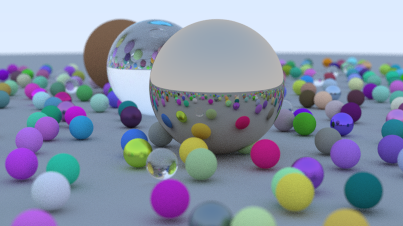

# Ray Tracing In One Weekend



Implementation of [Ray Tracing in One Weekend](https://raytracing.github.io/) using the new SDL3 GPU API with a compute shader

### Building

#### Windows

```bash
git clone https://github.com/jsoulier/ray_tracing_in_one_weekend --recurse-submodules
cd ray_tracing_in_one_weekend
mkdir build
cd build
cmake ..
cmake --build . --parallel 8 --config Release
cd bin
./rtiow.exe
```

#### Linux

```bash
git clone https://github.com/jsoulier/ray_tracing_in_one_weekend --recurse-submodules
cd ray_tracing_in_one_weekend
mkdir build
cd build
cmake .. -DCMAKE_BUILD_TYPE=Release
cmake --build . --parallel 8
cd bin
./rtiow
```

#### Shaders

Shaders are prebuilt.
To build locally, install [SDL_shadercross](https://github.com/libsdl-org/SDL_shadercross) to your path