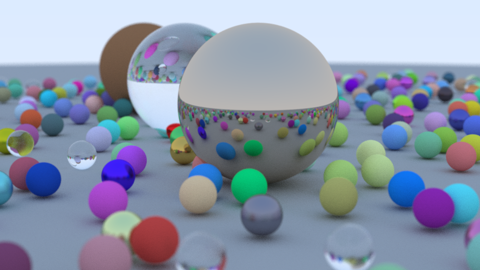

# SDL3 Ray Tracing In One Weekend

Implementation of [Ray Tracing in One Weekend](https://raytracing.github.io/) using the new SDL3 GPU API with compute shaders


*Finished render (200 samples, 20 bounces, 960x540)*

### Building

#### Windows

Install the [Vulkan SDK](https://www.lunarg.com/vulkan-sdk/) for glslc

```bash
git clone https://github.com/jsoulier/sdl3_ray_tracing_in_one_weekend --recurse-submodules
cd sdl3_rtiow
mkdir build
cd build
cmake ..
cmake --build . --parallel 8 --config Release
cd bin
./sdl3_rtiow.exe
```

#### Linux

```bash
sudo apt install glslc
```

```bash
git clone https://github.com/jsoulier/sdl3_ray_tracing_in_one_weekend --recurse-submodules
cd sdl3_rtiow
mkdir build
cd build
cmake .. -DCMAKE_BUILD_TYPE=Release
cmake --build . --parallel 8
cd bin
./sdl3_rtiow
```